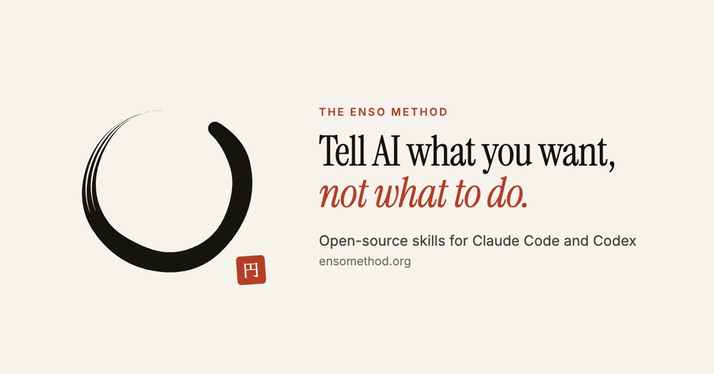
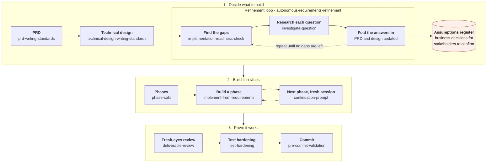

<p align="center">
  <a href="https://ensomethod.org"></a>
</p>

<p align="center">
  <a href="https://ensomethod.org"><b>ensomethod.org</b></a> ·
  <a href="#get-started">Get started</a> ·
  <a href="docs/how-the-enso-method-works.md">How it works</a> ·
  <a href="docs/enso-method-setup-guide.md">Setup guide</a>
</p>

# The Enso Method

**Tell AI what you want, not what to do.**

The Enso Method is a way of building production software with AI coding agents, and the
open-source agent skills for Claude Code and Codex that carry it out. You describe what you
want in plain language. The method turns it into a PRD, a technical design and a plan,
researches every open question and answers it or writes it down as an assumption, and then
the agents build it, phase after phase, while your attention goes elsewhere. The
requirements documents, not a chat history, drive the build.

It is built for the case most AI methods skip: **the person who decides isn't the one at the
keyboard.** A client, a business owner, a department head. The build keeps moving on
proposals they confirm or correct on their own schedule, and they are left with documents
they can actually read.

## Why

Whatever you don't tell the AI, it guesses. "Add refunds to checkout" leaves the real
questions open — partial refunds? store credit? what if the payment provider is down? — and
the agent answers each one itself, without telling you. Then come the minute-by-minute
corrections, and a month later nobody can say what the code was supposed to do.

The fix isn't a better prompt. It's doing the thinking before the build:

- **Requirements lead the build.** Work starts from a PRD and a technical design, and a
  meaningful change amends them before it is built.
- **Assumptions are green lights.** A business question is researched, answered with a
  proposal and a confidence level, and the build continues. Stakeholders confirm or correct
  it later.
- **Research, don't ask.** Technical questions are answered against the real code, data and
  APIs, not put to you.
- **Every phase ships.** Large work is cut into thin slices, each sized to one AI session.
- **Finished means proven.** Each acceptance criterion is checked by a test that would fail
  if the behavior were wrong, against real systems wherever they exist.

## How it works

Each step is a skill your agent runs, and each hands the next a document it can trust.
Refinement is a loop: it finds the gaps, researches each question against the real code and
data, and writes the answers back into the PRD and design, recording business decisions as
assumptions for stakeholders to confirm, until nothing is left to guess. Stages 2 and 3 run
once per phase: a phase is built, reviewed, hardened and committed, then `continuation-prompt`
hands the next one to a fresh session. An idea too big for one PRD first goes through
`prd-roadmap`.



Everything for one piece of work lives in one directory, and the documents stay in the repo
after the build, so the next change starts from what was decided:

```
docs/prds/customer-returns/
  customer-returns-prd.md
  technical-design.md
  assumptions.md               # business decisions proposed, awaiting confirmation
  phase-1-return-intake.md     # closed
  phase-2-refund-routing.md    # split into 2a and 2b
  phase-2a-card-refunds.md     # closed
  phase-2b-store-credit.md     # implementing
  phase-3-returns-dashboard.md # planned
```

It works on existing systems as well as new ones: the PRD covers the change, and the
technical design describes only the difference. [How it works](docs/how-the-enso-method-works.md)
has the confidence rules and the session discipline; [ensomethod.org](https://ensomethod.org)
has the full walkthrough and an example assumption.

## Get started

Install the skills in your agent:

```bash
# Claude Code
claude plugin marketplace add EnsoDynamics/enso-method
claude plugin install enso-method@enso-method

# Codex
codex plugin marketplace add EnsoDynamics/enso-method
codex plugin add enso-method@enso-method

# Other agents (Cursor, GitHub Copilot, Gemini CLI and more), with the skills CLI
npx skills add EnsoDynamics/enso-method -g
```

In Claude Code and Codex the skills install as a plugin, which names each one
`enso-method:<skill>` so none can clash with a same-named skill from somewhere else. To update
later, see the [setup guide](docs/enso-method-setup-guide.md#install-and-update). Then, in your
agent (in Codex, pick skills from the `$` menu or type the full name, such as
`$enso-method:prd-writing-standards`):

1. **Write the PRD.** Run `/prd-writing-standards` and describe what you want in your own
   words. Talk it through; the messy version is better than a tidy instruction.
2. **Design and refine.** Run `/technical-design-writing-standards`, then
   `/autonomous-requirements-refinement` to close the gaps.
3. **Build.** Run `/implement-from-requirements`. It sizes the work, splits it if it must,
   and builds, reviews and tests the first phase in the same session.

Before your first real project, plug in your team's engineering standards and add two
recommended lines to your global instructions: see the [setup guide](docs/enso-method-setup-guide.md).

## The skills

Skills load on demand by name and description, so you rarely invoke one directly. Each
directory under `skills/` with a `SKILL.md` is one skill, in the open
[Agent Skills](https://agentskills.io) format.

**Requirements and design**
- `prd-roadmap` — cut an idea too big for one PRD into an ordered roadmap of planned PRDs
- `prd-writing-standards` — write a PRD, and where the documents live
- `technical-design-writing-standards` — write or check a technical design
- `review-technical-design` — a senior-engineer review for designs that make hard-to-reverse decisions; its triage says which sections you need to read yourself
- `assumptions-document-writing`, `assumptions-document-feedback` — declare business assumptions and fold in stakeholder answers

**Refinement**
- `autonomous-requirements-refinement` — multi-pass refinement of the PRD, design and assumptions until they are ready to build
- `implementation-readiness-check` — a human checkpoint before implementation: surfaces every open question for you to confirm
- `investigate-question` — take one question to an answer with a confidence level

**Implementation**
- `implementation-lifecycle` — the umbrella: the assumptions philosophy, confidence thresholds and the No Loose Ends session discipline. Reload it to get a drifting session back on track
- `implement-from-requirements` — the default build from PRD and technical design
- `implement-from-discovery` — implement a fix found mid-work or raised in a bug report
- `phase-split` — split a too-large PRD into session-sized, shippable phases
- `continuation-prompt` — the copy-paste prompt that starts the next chat
- `phase-chain` — Codex only: run an authorized sequence of phases, one fresh task each

**Quality and principles**
- `deliverable-review`, `test-hardening`, `refactor-pass` — the post-build quality chain
- `test-audit` — once a phase or PRD is finished: grade every acceptance criterion's test evidence, then fill the gaps, missing first
- `pre-commit-validation` — commit-boundary checks for a checkout several sessions share
- `engineering-principles` — the principles the method depends on: no silent fallbacks, the testing evidence standard, production data, judgment calls
- `wall-clock-awareness` — cut waiting time in tests, builds and CI

## Who's behind it

The Enso Method is created and maintained by Doug Kerwin, author of *The Enterprise Vibe
Coding Playbook*, at [EnsoDynamics](https://ensodynamics.com). Every rule in it exists
because a real project needed it, and it is refined daily on production systems. If your
team wants help adopting it, that is what EnsoDynamics does.

## License and contributions

The skills are free to use, change and redistribute under the [MIT License](LICENSE),
including at work and in commercial products. The license covers the text and code, not the
name: please don't present a modified fork as The Enso Method.

Issues are welcome and forks are encouraged, but pull requests are generally not accepted.
See [CONTRIBUTING.md](CONTRIBUTING.md) for why.

---

<p align="center"><i>An ensō is a circle drawn in a single brushstroke. It is finished when the circle closes.<br/>So is every session: no loose ends.</i></p>
